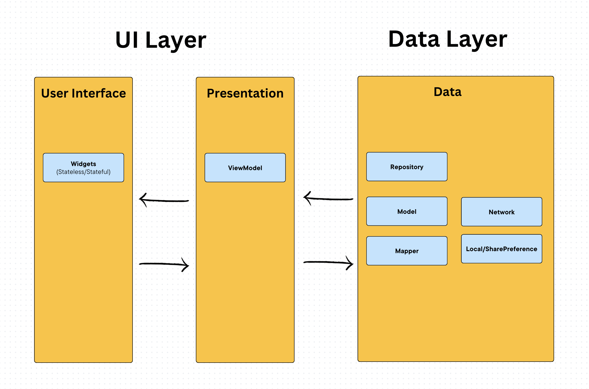

# taskmanager

A new Flutter project.

Minimal architecture for small-mid scale applications

#### 🏛️ Architecture
MVVM architecture

Setup:
1. Clone the repo
2. Run `flutter pub get`
3. Run `flutter pub run build_runner build --delete-conflicting-outputs`
4. Run `flutter run`
